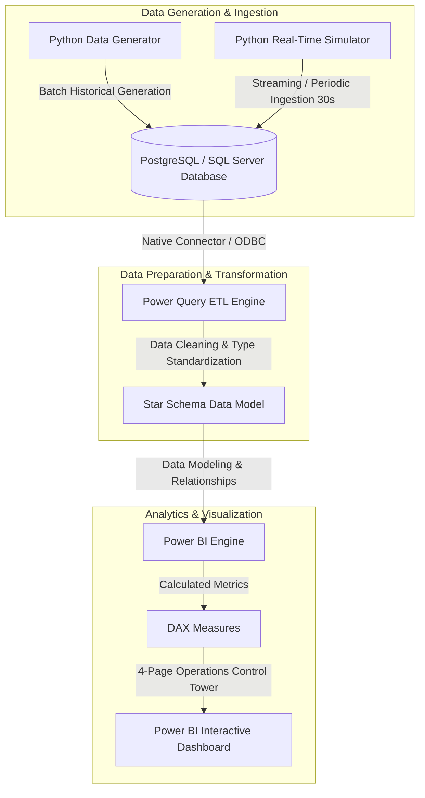

# Project Architecture: Real-Time Logistics & Delivery Performance Analytics

## 1. System Architecture Overview

## 2. Component Breakdown

### A. Synthetic Data Engine (Python)
- **Role**: Generates 50,000+ orders, 50,000+ shipments, 200,000+ delivery events, and 500,000+ vehicle GPS ping records based on realistic Indian logistics routes and operational dynamics.
- **Real-Time Simulator**: A script running on a configurable interval (e.g., every 30 seconds) that updates vehicle telemetry (speed, location, fuel) and generates delivery status changes.

### B. Relational Data Store (PostgreSQL / SQL Server)
- **Role**: Serves as the central operational data store (ODS) and data warehouse source.
- **Structure**: 9 normalized relational tables maintaining strict primary/foreign key integrity, indexes on lookup paths, and optimized analytical views.

### C. Power Query ETL Layer
- **Role**: Connects to the database, cleans raw fields, handles nulls/type casting, and computes pre-model dimensional attributes (e.g., delay category buckets, distance brackets).

### D. Power BI Data Model & DAX Layer
- **Role**: Implements a clean Star Schema with 5 Fact tables and 5 Dimension tables.
- **DAX Engine**: Evaluates key logistics performance metrics (On-Time Delivery %, Cost per KM, Fleet Utilization, Average Delay Hours, YoY Growth).

### E. Interactive 7-Page Operations Dashboard Suite
- **Page 1**: Executive Control Tower (Macro-level volume, fulfillment health, global SLA adherence)
- **Page 2**: Real-Time Fleet Telemetry & IoT Operations (Live GPS map, speed radar, fuel monitoring, engine status)
- **Page 3**: Delivery Performance & SLA Delay Analytics (Delay duration buckets, root-cause analysis, delayed route rankings)
- **Page 4**: Fleet Utilization & Maintenance Management (Asset readiness, mileage quartiles, electric vs diesel efficiency)
- **Page 5**: Driver Performance & Safety Scorecards (Objective driver rankings, experience vs on-time correlation, SLA compliance)
- **Page 6**: Freight Cost & Financial Unit Economics (Freight vs fuel breakdown, cost per KM, corridor profitability)
- **Page 7**: Customer & Order Demand Analytics (Customer segments, priority tier demand, revenue collection & payments)

---

## 3. Data Flow Architecture

1. **Generation / Simulation**: Python script executes ANSI-SQL inserts/updates directly into PostgreSQL/SQL Server.
2. **Database Persistence**: Tables and analytical views automatically update.
3. **Power BI Ingestion**: Power Query imports updated tables/views using DirectQuery or Scheduled/Manual Import Refresh.
4. **Model Refresh**: Star Schema updates relationships, DAX measures recalculate dynamic KPIs.
5. **Visual Render**: User views updated metrics on the Power BI dashboard.
