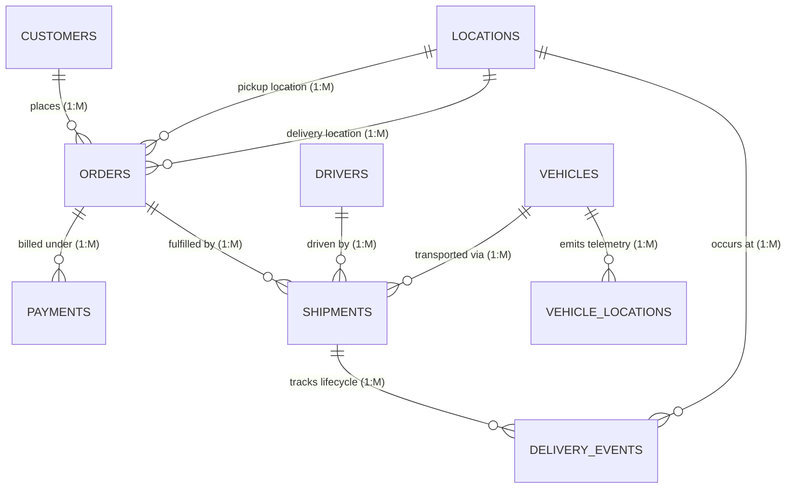

# Data Dictionary & Schema Specifications

This document details the database structure, table definitions, field data types, constraints, and relational cardinalities for the **Real-Time Logistics & Delivery Performance Analytics Database**.

---

## 1. Relational Entity Relationship Diagram (ERD)

---

## 2. Table Specifications & Data Dictionary

### 2.1 Table: `Customers`
- **Purpose**: Stores B2B and B2C customer details.
- **Primary Key**: `Customer_ID`

| Field Name | Data Type | Nullable | Description / Constraints |
| :--- | :--- | :--- | :--- |
| `Customer_ID` | `VARCHAR(20)` | NO | Primary Key. Format: `CUST-XXXXXX` |
| `Customer_Name` | `VARCHAR(100)` | NO | Full name of individual or enterprise business |
| `Customer_Type` | `VARCHAR(20)` | NO | Category: `'Enterprise'` or `'Retail'` |
| `Phone` | `VARCHAR(20)` | YES | Contact phone number |
| `Email` | `VARCHAR(100)` | YES | Contact email address |
| `City` | `VARCHAR(50)` | NO | Primary billing city |
| `State` | `VARCHAR(50)` | NO | State / Province |
| `Postal_Code` | `VARCHAR(10)` | YES | Postal PIN code |
| `Registration_Date` | `DATE` | NO | Date customer signed up |

---

### 2.2 Table: `Drivers`
- **Purpose**: Stores driver profile, licensing, experience, and status.
- **Primary Key**: `Driver_ID`

| Field Name | Data Type | Nullable | Description / Constraints |
| :--- | :--- | :--- | :--- |
| `Driver_ID` | `VARCHAR(20)` | NO | Primary Key. Format: `DRV-XXXXXX` |
| `Driver_Name` | `VARCHAR(100)` | NO | Full driver name |
| `License_Type` | `VARCHAR(20)` | NO | License classification: `'Heavy Vehicle'`, `'Commercial'`, `'Light Vehicle'` |
| `Experience_Years` | `INT` | NO | Number of years of driving experience ($\ge 0$) |
| `Phone` | `VARCHAR(20)` | YES | Driver mobile contact |
| `Rating` | `NUMERIC(3,2)` | YES | Performance rating ($1.00$ to $5.00$) |
| `Employment_Date` | `DATE` | NO | Date driver joined company |
| `Driver_Status` | `VARCHAR(20)` | NO | Current status: `'Active'`, `'On Leave'`, `'Suspended'`, `'Terminated'` |

---

### 2.3 Table: `Vehicles`
- **Purpose**: Tracks transport assets, payload limits, fuel efficiency, and assigned driver.
- **Primary Key**: `Vehicle_ID`
- **Foreign Key**: `Driver_ID` $\rightarrow$ `Drivers(Driver_ID)`

| Field Name | Data Type | Nullable | Description / Constraints |
| :--- | :--- | :--- | :--- |
| `Vehicle_ID` | `VARCHAR(20)` | NO | Primary Key. Format: `VEH-XXXXXX` |
| `Vehicle_Number` | `VARCHAR(20)` | NO | Unique license plate / registration code |
| `Vehicle_Type` | `VARCHAR(30)` | NO | Category: `'Heavy Truck'`, `'Container Truck'`, `'Medium Van'`, `'Light Van'` |
| `Capacity_KG` | `NUMERIC(10,2)` | NO | Maximum payload capacity in Kilograms ($> 0$) |
| `Fuel_Type` | `VARCHAR(20)` | NO | Fuel classification: `'Diesel'`, `'EV'`, `'CNG'`, `'Petrol'` |
| `Fuel_Efficiency` | `NUMERIC(5,2)` | NO | Fuel efficiency in KM per Liter or KM per kWh |
| `Driver_ID` | `VARCHAR(20)` | YES | FK referencing `Drivers(Driver_ID)` |
| `Vehicle_Status` | `VARCHAR(20)` | NO | Status: `'Active'`, `'In Maintenance'`, `'Idle'`, `'Decommissioned'` |
| `Registration_Date` | `DATE` | NO | Fleet onboarding date |

---

### 2.4 Table: `Locations`
- **Purpose**: Geographical logistics nodes (warehouses, hubs, distribution centers, delivery hubs).
- **Primary Key**: `Location_ID`

| Field Name | Data Type | Nullable | Description / Constraints |
| :--- | :--- | :--- | :--- |
| `Location_ID` | `VARCHAR(20)` | NO | Primary Key. Format: `LOC-XXXXXX` |
| `Location_Name` | `VARCHAR(100)` | NO | Descriptive node name (e.g., `'Chennai South Hub'`) |
| `City` | `VARCHAR(50)` | NO | City name |
| `State` | `VARCHAR(50)` | NO | State name |
| `Latitude` | `NUMERIC(9,6)` | NO | GPS Latitude coordinate (e.g. `13.082700`) |
| `Longitude` | `NUMERIC(9,6)` | NO | GPS Longitude coordinate (e.g. `80.270700`) |
| `Location_Type` | `VARCHAR(30)` | NO | Node type: `'Warehouse'`, `'Distribution Center'`, `'Hub'`, `'Customer Site'` |

---

### 2.5 Table: `Orders`
- **Purpose**: Commercial customer order requests.
- **Primary Key**: `Order_ID`
- **Foreign Keys**: 
  - `Customer_ID` $\rightarrow$ `Customers(Customer_ID)`
  - `Pickup_Location_ID` $\rightarrow$ `Locations(Location_ID)`
  - `Delivery_Location_ID` $\rightarrow$ `Locations(Location_ID)`

| Field Name | Data Type | Nullable | Description / Constraints |
| :--- | :--- | :--- | :--- |
| `Order_ID` | `VARCHAR(20)` | NO | Primary Key. Format: `ORD-XXXXXX` |
| `Customer_ID` | `VARCHAR(20)` | NO | FK referencing `Customers(Customer_ID)` |
| `Order_Date` | `TIMESTAMP` | NO | Order placement timestamp |
| `Pickup_Location_ID` | `VARCHAR(20)` | NO | FK referencing `Locations(Location_ID)` |
| `Delivery_Location_ID` | `VARCHAR(20)` | NO | FK referencing `Locations(Location_ID)` |
| `Priority` | `VARCHAR(20)` | NO | Order priority level: `'Express'`, `'High'`, `'Standard'`, `'Low'` |
| `Order_Value` | `NUMERIC(12,2)` | NO | Financial value of cargo in INR ($\ge 0$) |
| `Weight_KG` | `NUMERIC(10,2)` | NO | Total cargo weight in Kilograms ($> 0$) |
| `Expected_Delivery_Date`| `TIMESTAMP` | NO | Promised target delivery timestamp |
| `Order_Status` | `VARCHAR(20)` | NO | Status: `'Pending'`, `'Processing'`, `'In Transit'`, `'Delivered'`, `'Cancelled'` |

---

### 2.6 Table: `Shipments`
- **Purpose**: Transportation execution matching assigned driver, vehicle, and order.
- **Primary Key**: `Shipment_ID`
- **Foreign Keys**:
  - `Order_ID` $\rightarrow$ `Orders(Order_ID)`
  - `Vehicle_ID` $\rightarrow$ `Vehicles(Vehicle_ID)`
  - `Driver_ID` $\rightarrow$ `Drivers(Driver_ID)`

| Field Name | Data Type | Nullable | Description / Constraints |
| :--- | :--- | :--- | :--- |
| `Shipment_ID` | `VARCHAR(20)` | NO | Primary Key. Format: `SHP-XXXXXX` |
| `Order_ID` | `VARCHAR(20)` | NO | FK referencing `Orders(Order_ID)` |
| `Vehicle_ID` | `VARCHAR(20)` | NO | FK referencing `Vehicles(Vehicle_ID)` |
| `Driver_ID` | `VARCHAR(20)` | NO | FK referencing `Drivers(Driver_ID)` |
| `Dispatch_Time` | `TIMESTAMP` | NO | Departure timestamp from pickup node |
| `Expected_Delivery_Time`| `TIMESTAMP` | NO | Target delivery timestamp based on route matrix |
| `Actual_Delivery_Time` | `TIMESTAMP` | YES | Actual completion timestamp (NULL if in transit) |
| `Distance_KM` | `NUMERIC(10,2)` | NO | Distance traveled in Kilograms / Kilometers ($> 0$) |
| `Shipment_Status` | `VARCHAR(20)` | NO | Status: `'Dispatched'`, `'In Transit'`, `'Delivered'`, `'Delayed'`, `'Cancelled'` |
| `Shipping_Cost` | `NUMERIC(10,2)` | NO | Total freight charge billed for transport ($\ge 0$) |
| `Fuel_Cost` | `NUMERIC(10,2)` | NO | Estimated fuel expense incurred ($\ge 0$) |

---

### 2.7 Table: `Delivery_Events`
- **Purpose**: Audit trail for lifecycle milestones and delays.
- **Primary Key**: `Event_ID`
- **Foreign Keys**:
  - `Shipment_ID` $\rightarrow$ `Shipments(Shipment_ID)`
  - `Location_ID` $\rightarrow$ `Locations(Location_ID)`

| Field Name | Data Type | Nullable | Description / Constraints |
| :--- | :--- | :--- | :--- |
| `Event_ID` | `BIGSERIAL` / `BIGINT` | NO | Primary Key. Auto-incrementing identifier |
| `Shipment_ID` | `VARCHAR(20)` | NO | FK referencing `Shipments(Shipment_ID)` |
| `Event_Time` | `TIMESTAMP` | NO | Timestamp of event occurrence |
| `Event_Type` | `VARCHAR(30)` | NO | Milestone: `'Order Created'`, `'Picked Up'`, `'In Transit'`, `'At Hub'`, `'Out for Delivery'`, `'Delivered'`, `'Delayed'`, `'Cancelled'` |
| `Location_ID` | `VARCHAR(20)` | YES | FK referencing `Locations(Location_ID)` |
| `Remarks` | `TEXT` | YES | Additional operational notes / delay reasons |

---

### 2.8 Table: `Vehicle_Locations`
- **Purpose**: High-frequency streaming telemetry emitted by vehicles during transport.
- **Primary Key**: `Location_Record_ID`
- **Foreign Key**: `Vehicle_ID` $\rightarrow$ `Vehicles(Vehicle_ID)`

| Field Name | Data Type | Nullable | Description / Constraints |
| :--- | :--- | :--- | :--- |
| `Location_Record_ID` | `BIGSERIAL` / `BIGINT` | NO | Primary Key. Telemetry record ID |
| `Vehicle_ID` | `VARCHAR(20)` | NO | FK referencing `Vehicles(Vehicle_ID)` |
| `Timestamp` | `TIMESTAMP` | NO | Ping timestamp |
| `Latitude` | `NUMERIC(9,6)` | NO | Live GPS Latitude |
| `Longitude` | `NUMERIC(9,6)` | NO | Live GPS Longitude |
| `Speed_KMH` | `NUMERIC(5,2)` | NO | Current vehicle speed in KM/H ($\ge 0$) |
| `Fuel_Level` | `NUMERIC(5,2)` | NO | Remaining tank percentage ($0.00$ to $100.00\%$) |
| `Engine_Status` | `VARCHAR(20)` | NO | Engine state: `'Running'`, `'Idling'`, `'Stopped'` |

---

### 2.9 Table: `Payments`
- **Purpose**: Commercial financial transactions for customer orders.
- **Primary Key**: `Payment_ID`
- **Foreign Key**: `Order_ID` $\rightarrow$ `Orders(Order_ID)`

| Field Name | Data Type | Nullable | Description / Constraints |
| :--- | :--- | :--- | :--- |
| `Payment_ID` | `VARCHAR(20)` | NO | Primary Key. Format: `PAY-XXXXXX` |
| `Order_ID` | `VARCHAR(20)` | NO | FK referencing `Orders(Order_ID)` |
| `Payment_Date` | `TIMESTAMP` | NO | Transaction processing timestamp |
| `Payment_Method` | `VARCHAR(30)` | NO | Method: `'UPI'`, `'Credit Card'`, `'Bank Transfer'`, `'Net Banking'`, `'COD'` |
| `Payment_Status` | `VARCHAR(20)` | NO | Status: `'Completed'`, `'Pending'`, `'Failed'`, `'Refunded'` |
| `Amount` | `NUMERIC(12,2)` | NO | Transaction amount in INR ($\ge 0$) |

---

## 3. Detailed Relationship Cardinality Analysis

1. **`Customers` $\rightarrow$ `Orders` (1 : N)**
   - **Rationale**: One customer can place multiple orders over time. Each order belongs to exactly one customer.
2. **`Locations` $\rightarrow$ `Orders` (1 : N)**
   - **Rationale**: A location (e.g. Chennai Warehouse) can act as the pickup point or delivery point for many orders.
3. **`Orders` $\rightarrow$ `Shipments` (1 : 1 or 1 : N)**
   - **Rationale**: In our system, each commercial order generates a shipment execution record.
4. **`Drivers` $\rightarrow$ `Shipments` (1 : N)**
   - **Rationale**: One driver executes multiple shipments across their employment history.
5. **`Vehicles` $\rightarrow$ `Shipments` (1 : N)**
   - **Rationale**: A single vehicle transports multiple shipments sequentially over time.
6. **`Shipments` $\rightarrow$ `Delivery_Events` (1 : N)**
   - **Rationale**: A shipment moves through several milestone events (`Picked Up`, `In Transit`, `Out for Delivery`, `Delivered`).
7. **`Vehicles` $\rightarrow$ `Vehicle_Locations` (1 : N)**
   - **Rationale**: Each active vehicle streams periodic telemetry pings (every 30 seconds or 1 minute) while operating.
8. **`Orders` $\rightarrow$ `Payments` (1 : N)**
   - **Rationale**: An order can have one or more payment attempts/installments.
