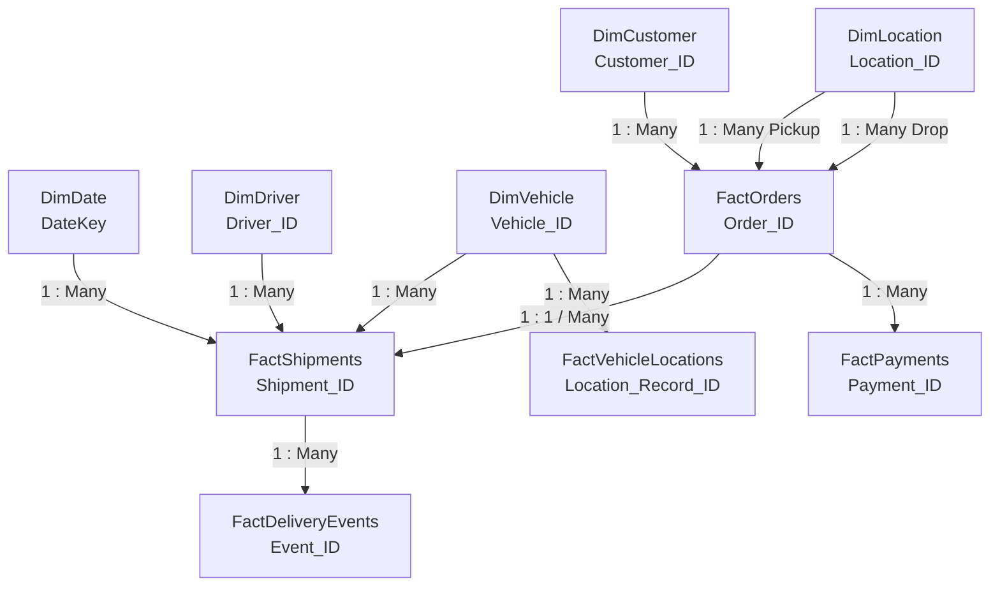

# Power BI Star Schema Data Model

## 1. Dimensional Architecture

The reporting engine is built on a clean **Star Schema** to ensure high-speed VertiPaq engine compression, simplified DAX measures, and predictable relationship filtering.

---

## 2. Table Classification

### Dimensions (Context Tables)
- **`DimDate`**: Dynamic continuous calendar table (Year, Quarter, Month, Weekday).
- **`DimCustomer`**: Customer profiling (Name, Customer_Type, City, State).
- **`DimDriver`**: Driver credentials (Name, License_Type, Experience_Years, Baseline_Rating).
- **`DimVehicle`**: Fleet assets (Vehicle_Number, Vehicle_Type, Capacity_KG, Fuel_Type, Fuel_Efficiency).
- **`DimLocation`**: Geographical nodes (Location_Name, City, State, Latitude, Longitude, Location_Type).

### Facts (Transactional Event Tables)
- **`FactOrders`**: High-level sales orders, required delivery dates, and package weights.
- **`FactShipments`**: Core operational grain (Dispatch, Delivery, Distance, Shipping Cost, Fuel Cost).
- **`FactDeliveryEvents`**: Detailed lifecycle audit trail (Picked Up, In Transit, Delayed, Delivered).
- **`FactVehicleLocations`**: High-frequency IoT GPS coordinates, speed, and fuel readings.
- **`FactPayments`**: Revenue collection transactions and settlement methods.

---

## 3. Relationship Matrix in Power BI Desktop

| From Table (Fact) | Foreign Key | To Table (Dimension) | Primary Key | Cardinality | Cross Filter Direction |
| :--- | :--- | :--- | :--- | :--- | :--- |
| `FactShipments` | `Driver_ID` | `DimDriver` | `Driver_ID` | Many to One (`*:1`) | Single (`DimDriver` filters `FactShipments`) |
| `FactShipments` | `Vehicle_ID` | `DimVehicle` | `Vehicle_ID` | Many to One (`*:1`) | Single (`DimVehicle` filters `FactShipments`) |
| `FactShipments` | `Order_ID` | `FactOrders` | `Order_ID` | Many to One (`*:1`) | Both (or 1:1) |
| `FactOrders` | `Customer_ID` | `DimCustomer` | `Customer_ID` | Many to One (`*:1`) | Single (`DimCustomer` filters `FactOrders`) |
| `FactOrders` | `Pickup_Location_ID` | `DimLocation` | `Location_ID` | Many to One (`*:1`) | Single (Active) |
| `FactOrders` | `Delivery_Location_ID` | `DimLocation` | `Location_ID` | Many to One (`*:1`) | Inactive (use `USERELATIONSHIP` in DAX) |
| `FactPayments` | `Order_ID` | `FactOrders` | `Order_ID` | Many to One (`*:1`) | Single (`FactOrders` filters `FactPayments`) |
| `FactDeliveryEvents` | `Shipment_ID` | `FactShipments` | `Shipment_ID` | Many to One (`*:1`) | Single (`FactShipments` filters `FactDeliveryEvents`) |
| `FactVehicleLocations`| `Vehicle_ID` | `DimVehicle` | `Vehicle_ID` | Many to One (`*:1`) | Single (`DimVehicle` filters `FactVehicleLocations`) |
| `FactShipments` | `Dispatch_Date` | `DimDate` | `DateKey` | Many to One (`*:1`) | Single (Active) |

---

## 4. Best Practices Configured
1. **Hide Foreign Keys in Report View**: Hide `Driver_ID`, `Vehicle_ID`, and `Customer_ID` in the fact tables to ensure users only slice by dimension tables.
2. **Sort by Column**: Configure `Month Name` to sort by `Month Number`, and `Day of Week` to sort by `Day Number of Week`.
3. **Dedicated Measures Table**: Create an empty table `_Measures` to house all business DAX calculations cleanly.
